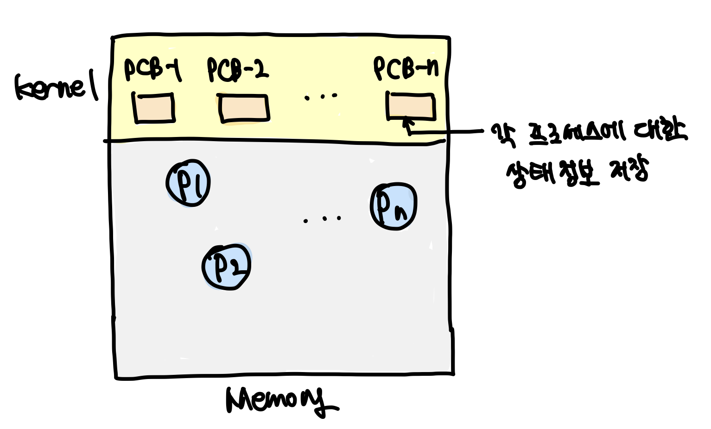
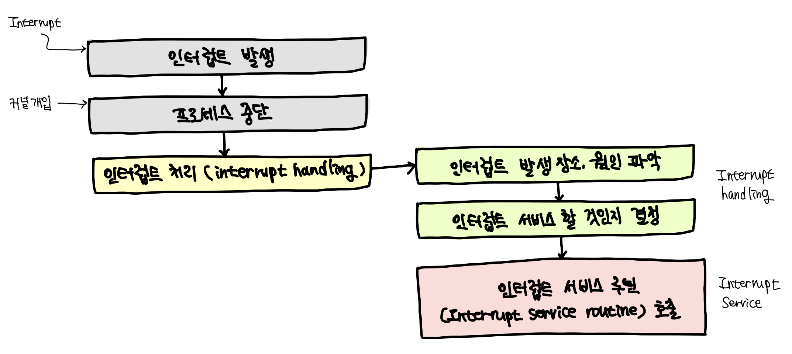
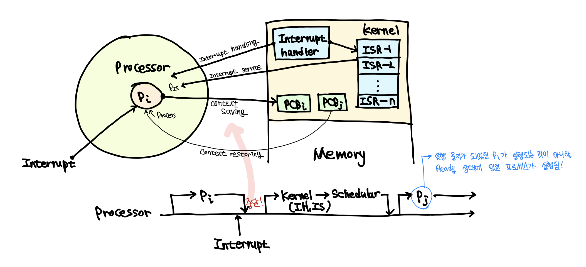

### Job vs Process

* **작업(Job) / 프로그램(Program)**
  * 실행할 **프로그램 + 데이터**
  * 컴퓨터 시스템에 실행을 요청하기 전의 상태
* **프로세스(Process)**
  * 실행을 위해 **시스템(커널)에 등록된 작업**
  * 시스템 성능 향상을 위해 커널에 의해 관리 됨


### 프로세스의 정의

* **실행중인 프로그램**
  * **커널에 등록**되고 커널에 관리하에 있는 **작업**
  * 각종 자원들을 요청하고 할당받을 수 있는 개체
  * 프로세스 관리 블록(PCB)을 할당 받은 개체
  * 능동적인 개체(active entity)
    * 실행 중에 각종 자원을 요구, 할당, 반납하며 진행
* **Process Control Block(PCB)**
  * 커널 공간(kernel space) 내에 존재
  * 각 프로세스들에 대한 정보를 관리


### 자원(Resource)의 개념

* **커널의 관리하에 프로세스에게 할당/반납되는 수동적 개체(passive entity)**
* **자원의 분류**
  * **H/W resources**
    * Processor, memory disk, monitor, keyboard, Etc.
  * **S/W resources**
    * Message, signal, files, installed SWs, Etc.


### Process Control Block(PCB)

* OS가 프로세스 관리에 필요한 정보를 저장
* 프로세스 생성시, 생성됨




### PCB가 관리하는 정보

* **PID: Process Identification Number**
  * 프로세스 고유 식별 정보
* **스케줄링 정보**
  * 프로세스 우선순위 등과 같은 스케줄링 관련 정보들
* **프로세스 상태**
  * 자원 할당, 요청 정보 등
* **메모리 관리 정보**
  * Page table, segment table 등
* **입출력 상태 정보**
  * 할당 받은 입출력 장치, 파일 등에 대한 정보 등
* **문맥 저장 영역(context save area)**
  * 프로세스의 레지스터 상태를 저장하는 공간 등
* **계정 정보**
  * 자원 사용 시간 등을 관리

```
PCB 정보는 OS 별로 서로 다름
PCB 참조 및 갱신 속도는 OS의 성능을 결정 짓는 중요한 요소 중 하나!
```


### 프로세스의 상태(Process States)

* **프로세스 - 자원 간의 상호작용에 의해 결정**
* **프로세스 상태 및 특성**


### Process State Transition Diagram


### Created State


* **작업(Job)을 커널에 등록**
* **PCB 할당 및 프로세스 생성**
* **커널**
  * **가용 메모리 공간** 체크 및 프로세스 상태 전이
    * <u>Ready</u> or <u>Suspended ready</u>


### Ready State


* **프로세서 외에 다른 모든 자원을 할당 받은 상태**
  * 프로세서(CPU) 할당 대기 상태
    * Running 상태에서 프로세서만 없는 상태!
  * 즉시 실행 가능 상태
* **Dispatch(or Schedule)**
  * Ready state → running state
  * 프로세서를 할당받아서 running 상태가 되는 것


### Running State


* **프로세서와 필요한 자원을 모두 할당 받은 상태**
* **Preemption**
  * Running state → ready states
    * 프로세서를 반납했을 때
  * 프로세서 스케줄링 (e.g, time-out, priority changes)
* **Block/sleep**
  * Running state → asleep state
  * I/O 등 자원 할당 요청


### Blocked/Asleep State


* **프로세서 외에 다른 자원을 기다리는 상태**
  * 자원 할당은 System call에 의해 이루어 짐
* **Wake-up**
  * Asleep state → ready state
  * 다른 프로세스가 작업 중일 수도 있으니 asleep에서 running 상태로 바로 가지 못하고, asleep 상태에서 ready 상태로 변함


### Suspended State


* **메모리를 할당 받지 못한(빼앗긴) 상태**
  * Memory images를 swap device에 보관
    * Swap device: 프로그램 정보 저장을 위한 특별한 파일 시스템
    * 다시 Memory가 할당되면, swap device를 통해 메모리 복구
  * 커널 또는 사용자에 의해 발생
* **Swap-out(suspended), Swap-in(resume)**


### Terminated/Zombie State


* **프로세스 수행이 끝난 상태**
* **모든 자원 반납 후,**
* **커널 내에 일부 PCB 정보만 남아있는 상태**
  * 이후 프로세스 관리를 위해 정보 수립


### 인터럽트(Interrupt)

* **예상치 못한, 외부에서 발생한 이벤트**
  * Unexpected, external events
* **인터럽트의 종류**
  * I/O interrupt
  * Clock interrupt
  * Console interrupt
  * Program check interrupt
  * Machine check interrupt
  * Inter-process interrupt
  * System call interrupt


### 인터럽트 처리 과정






### Context Switching(문맥 교환)

* **Context**
  * 프로세스와 관련된 정보들의 집합
  * Context는 CPU와 memory에 저장됨
    * **CPU register context** => in CPU
    * Code & data, Stack, PCB => in menory
* **Context saving**
  * 현재 프로세스의 **Register context를 저장**하는 작업
* **Context restoring**
  * Register context를 프로세스로 복구하는 작업
* **Context switching ≅ Process switching**
  * Context saving과 Context restoring을 합친 것(Context가 바뀌는 것)
  * 실행중인 프로세스의 context를 저장하고, 앞으로 실행할 프로세스의 context를 복구하는 일
    * 커널의 개입으로 이루어짐


### Context Switch Overhead

* 시스템마다 다르겠지만, 우리가 사용하는 컴퓨터에는 실행되는 프로세스가 많음 → Context Switching이 많이 일어날 것!
* **Context switching에 소요되는 비용**
  * OS마다 다름
  * OS 성능에 큰 영향을 줌
* **불필요한 Context switching을 줄이는 것이 중요**
  * 예) 스레드(thread) 사용 등