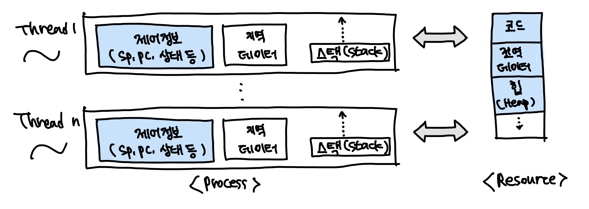

### 프로세스(Process)와 스레드(Thread)

* 프로세스는 자원을 할당받고, 자원을 제어함
* 자원과 제어 중, 제어만 분리한 것을 스레드라고 함

### 스레드(Thread)

* 같은 프로세스의 스레드들은 동일한 주소 공간 공유함
* **Light Weight Process(LWP)**
    * 프로세스는 원래 자원과 제어를 각각 가지고 있어야 되는데, 스레드는 자원을 공유하고, 제어정보만 가지고 있기 때문
* **프로세서(e.g, CPU) 활용의 기본 단위**
* **구성요소**
    * Thread ID
    * Register set(PC, SP 등)
    * Stack(i.e. local data)
* **제어 요소 외 코드, 데이터 및 자원들은 프로세스 내 다른 스레드들과 공유**
* **전통적 프로세스 = 단일 스레드 프로세스**

### 스레드의 장점

* **사용자 응답성(Responsiveness)**
    * 일부 스레드의 처리가 지연되어도, 다른 스레드는 작업을 계속 처리 할 수 있음
* **자원 공유(Resource sharing)**
    * 자원을 공유해서 효율성 증가(커널의 개입을 피할 수 있음)
        * 예) 동일 address space에서 스레드 여러 개
        * 프로세스가 번갈아 가면서 자원을 사용한다면 context switch가 발생되어 서비스에 사용되는 비용이 높아짐
        * Thread를 사용한다면, 자원을 동시에 사용할 수 있으므로, context switch 발생이 발생하지 않으며, 자원을 효율적으로 사용할 수 있음
* **경제성(Economy)**
    * 프로세스의 생성, context switch에 비해 효율적
* **멀티 프로세서(multi-processor) 활용**
    * 병렬처리를 통해 성능 향상

### 사용자 수준 스레드(User Thread)

* **사용자 영역의 스레드 라이브러리로 구현됨**
    * 스레드의 생성, 스케줄링 등
    * POSIX threads, Win32 threads, Java thread API 등
* **커널은 스레드의 존재를 모름**
    * 커널의 관리(개입)을 받지 않음
        * 생성 및 관리의 부하가 적음, 유연한 관리가 가능
        * 이식성이 높음
    * 커널은 프로세스 단위로 자원을 할당
        * 하나의 스레드가 block 상태가 되면, 모든 스레드가 대기(single-threaded kernel의 경우)

### 커널 수준 스레드(Kernel Threads)

* **OS(Kernel)가 직접 관리**
* **커널 영역에서 스레드의 생성, 관리 수행**
    * context switching 등 부하(Overhead)가 큼
* **커널이 각 스레드를 개별적으로 관리**
    * 프로세스 내 스레드들이 병행 수행 가능
        * 하나의 스레드가 block 상태가 되어도, 다른 스레드는 계속 작업 수행 가능

### Multi-Threading Model

* **다대다(n:1) 모델**
    * 사용자 수준 스레드
* **일대일(1:1) 모델**
    * 커널 수준 스레드
* **다대다(n:m) 모델**
    * n ≥ m
    * 혼합형 스레드

### 혼합형(n:m) 스레드

* **n개 사용자 수준 스레드 - m개의 커널 스레드(n ≥ m)**
    * 사용자는 원하는 수만큼 스레드를 사용할 수 있음
    * 커널 스레드는 자신에게 할당된 하나의 사용자 스레드가 block 상태가 되어도, 다른 스레드를 수행할 수 있음
        * 병행 처리 가능
* **효율적이면서도 유연함**