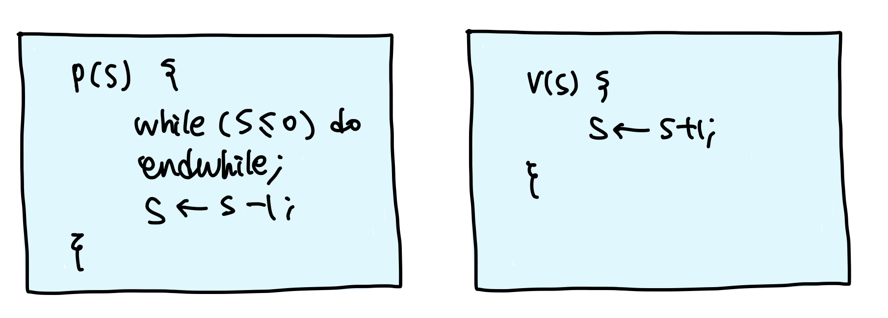

## Process Synchronization

### Process Synchronization(동기화)

* **다중 프로그래밍 시스템**
  * 여러 개의 프로세스들이 존재
  * 프로세스들은 서로 독립적으로 동작
  * 공유 자원 또는 데이터가 있을 때, 문제가 발생할 수 있음
* **동기화(Synchronization)**
  * 프로세스들이 서로 동작을 맞추는 것
  * 프로세스들이 서로 정보를 공유하는 것


### Asynchronous and Concurrent P's

* **비동기적(Asynchronous)**
  * 프로세스들이 서로에 대해 모름
* **병행적(Concurrent)**
  * 여러 개의 프로세스들이 동시에 시스템에 존재
* **병행 수행중인 비동기적 프로세스들이 공유하기 때문에 자원에 동시 접근 시, 문제가 발생할 수 있음**


### Terminologies

* **Shared date(공유 데이터)** or Critical data
  * 여러 프로세스들이 공유하는 데이터
* **Critical section(임계 영역)**
  * 공유 데이터를 접근하는 코드 영역(code segment)
* **Mutual exclusion(상호배제)**
  * 둘 이상의 프로세스가 동시에 critical section에 진입하는 것을 막는 것


### Mutual Exclusion Methods


* **primitive**
  * 가장 기본이 되는 연산이라고 많이 해석
* **Mutual exclusion primitives**
  * **enterCS()** primitive
    * Critical section 진입 전 검사
    * 다른 프로세스가 critical section 안에 있는지 검사
  * **exitCS()** primitive
    * Critical section을 벗어날 때의 후처리 과정
    * Critical section을 벗어남을 시스템이 알림


### Requirements for ME primitives

* **Mutual exclusion(상호배제)**
  * Critical section(CS)에 프로세스가 있으면, 다른 프로세스의 진입을 금지
* **Progress(진행)**
  * CS 안에 있는 프로세스 외에는, 다른 프로세스가 CS에 진입하는 것을 방해하면 안됨
* **Bounded waiting(한정 대기)**
  * 프로세스의 CS 진입은 유한시간 내에 허용되어야 됨


## SW solutions

### Dekker's Algorithm

* **Two process ME을 보장하는 최조의 알고리즘**


### Peterson's Algorithm

* **Dekker's algorithm보다 간단하게 구현**


### N-Process Mutual Exclusion

* **다익스트라**
  * 최초로 프로세스 n개의 상호배제 문제를 소프트웨어적으로 해결
  * 실행 시간이 가장 짧은 프로세스에 프로세서를 할당하는 세마포 방법으로 가장 짧은 평균 대기시간이 걸림
* **크누스**
  * 이전 알고리즘 관계 분석 후 일치하는 패턴을 찾아 패턴의 반복을 줄여서 프로세스에 프로세서 할당
  * 무한정 연기할 가능성을 배제하는 해결책을 제시했으나, 프로세스들일 아주 오래 기다려야 됨
* **램포트**
  * 사람들로 붐비는 빵집에서 번호표를 뽑아 빵을 사려고 기다리는 사람에서 비유해 만든 알고리즘
  * 준비 상태 큐에서 기다리는 프로세스마다 우선순위를 부여아형 그 중 우선순위가 가장 높은 프로세스에 먼저 프로세서를 할당함
* **핸슨**
  * 실행 시간이 긴 프로세스에 불리한 부분을 보완하는 것
  * 대기시간과 실행시간을 이용하는 모니터 방법
  * 분산 처리 프로세서 간의 병행성 제어 많이 발표


### Dijkstra's Algorithm

* **Dijkstra 알고리즘의 flag[]변수**
  * idle: 프로세스가 임계 지역 진입을 시도하고 있지 않을 때
  * want-in: 프로세스의 임계 지역 진입 시도 1단계일 때
  * in-CS: 프로세스의 임계 지역 진입 시도 2단계 및 임계 지역 내에 있을 때


### SW Solution

* **SW solution들의 문제점**
  * 속도가 느림
    * 구현이 복잡함
    * ME primitive 실행 중 preemption이 될 수 있음
      * 공유 데이터 수정 중은 interrupt를 억제함으로써 해결 가능
        * Overhead 발생
    * Busy waiting
      * Inefficient


## HW solution

### Synchronization Hardware

* **TestAndSet(TAS) instruction**
  * Test와 Set을 한 번에 수행하는 기계어
  * Machine instruction
    * Atomicity, Indivisible
    * **실행 중 interrupt를 받지 않음(preemption 되지 않음)**
  * Busy waiting
    * Inefficient


### HW Solution

* **장점**
  * 구현이 간단
* **단점**
  * Busy waiting
    * inefficient
* **Busy waiting 문제를 해소한 상호배제 기법**
  * **Semaphore**
    * 대부분의 OS들이 사용하는 기법


## OS supported SW solution

### Spinlock



* **정수형 변수**
* **초기화, P(), V() 연산으로만 접근 가능**
  * 위 연산들은 indivisible(or atomic) 연산
    * OS support (OS가 연산을 보장해줌!)
    * 전체가 한 instruction cycle에 수행 됨
* `S: 물건의 개수, P: 물건을 꺼내는 것, V: 물건을 집어놓는 것` 이라고 생각
* **문제점**
  * 멀티프로세서 시스템에서만 사용 가능
  * Busy waiting


### Semaphore

* **1965년 Dijksta가 제안**
* **Busy waiting 문제 해결**
* 음이 아닌 정수형 변수(S)
  * 초기화 연산, P(), V()로만 접근 가능
    * P: Probern(검사)
    * V: Verhogen(증가)
  * **임의의 S 변수 하나에 ready queue 하나가 할당 됨**
* **Binary semaphore**
  * S가 0과 1 두 종류의 값만 갖는 경우
  * 상호배제느 프로세스 동기화의 목적으로 사용
* **Counting semaphore**
  * S가 0이상의 정수값을 가질 수 있는 경우
  * Producer-Consumer문제 등을 해결하기 위해 사용
    * 생산자-소비자 문제

* **초기화 연산**

  * S 변수에 초기값을 부여하는 연산

* **P() 연산**

  ```
  if(S > 0)
  	then S ← S - 1;
  	else wait on the queue Q;
  ```

* **V() 연산**

  ```
  if(∃ waiting processes on Q)
  	then wakeup on of them;
  	else S ← S + 1;
  ```

* **모두 indivisible 연산**
  * OS support
  * 전체가 한 instruction cycle에 수행 됨
* **Semaphore로 해결 가능한 동기화 문제들**
  * 상호배제 문제
    * Mutual exclusion
  * 프로세스 동기화 문제
    * process synchronization problem
  * 생산자-소비자 문제
    * producer-consumer problem
  * Reader-writer문제
  * Dining philosopher problem
  * 기타
* **Process synchronization**
  * Process들의 실행 순서 맞추기
    * 프로세스들은 병행적이며, 비동기적으로 수행
* **Producer-Consumer problem**
  * 생산자(Producer) 프로세스
    * 메시지를 생성하는 프로세스 그룹
  * 소비자(Consumer) 프로세스
    * 메시지를 전달받는 프로세스 그룹
* **Producer-Consumer problem with single buffer**
* **Producer-Consumer problem with N-buffer**
* **Reader-Writer problem**
  * **Reader** 
    * 데이터에 대해 읽기 연산만 수행
  * **Writer**
    * 데이터에 대해 갱신 연산을 수행
  * **데이터 무결성 보장 필요**
    * Reader들은 동시에 데이터 접근 가능
    * Writer들(또는 reader와 write)이 동시 데이터 접근 시, 상호배제(동기화) 필요
  * **해결법**
    * reader/writer에 대한 우선권 부여
      * reader preference solution
      * writer preference solution
* **No busy waiting**
  * 기다려야 하는 프로세스는 block(asleep) 상태가 됨
  * busy waiting 문제가 해결!
* **Semaphore queue에 대한 wake-up 순서는 비결정적**
  * Starvation problem
  * 운이 나쁘면, 계속해서 기다리는 프로세스가 생길 수 있음


### Eventcount/Sequencer

* **은행의 번호표와 비슷한 개념**
* **Sequencer**
  * 정수형 변수
  * 생성시 0으로 초기화, 감소하지 않음
  * 발생 사건들의 순서 유지
  * ticket() 연산으로만 접근 가능
* **ticket(S)**
  * 현재까지 ticket() 연산이 호출된 횟수를 반환
  * Indivisible operation
* **<u>E</u>ventcount**
  * 정수형 변수
  * 생성시 0으로 초기화, 감소하지 않음
  * 특정 사건의 발생 횟수를 기록
  * read(E), advance(E), await(E, v) 연산으로만 접근 가능
* **read(E)**
  * 현재 Eventcount 값 반환
* **advance(E)**
  * E ← E + 1
  * E를 기다리고 있는 프로세스를 깨움(wake-up)
* **await(E, v)**
  * V는 정수형 변수
  * if(E < v) 이면 E에 연결된 Qe(대기실)에 프로세스 전달(push)
    * v: 부른 사람 변수
* **No busy waiting**
* **No starvation**
  * FIFO scheduling for Qe
* **Semaphore 보다 더 low-level control이 가능**


### High-level Mechanism

* **Monitor**
* Path expressions
* Serializers
* Critical region, conditional critical region
* **Langauge-level constructs**
* **Object-Oriented conecpt과 유사**
* **사용이 쉬움**


### Monitor

* **공유 데이터와 Ciritical section의 집합**
* **Conditional variable**
  * wait(), signal() operations


### Monitor의 구조

* **Entry queue(진입 큐)**
  * 모니터 내의 procedure 수만큼 존재
* **Mutual exclusion**
  * 모니터 내에는 항상 하나의 프로세스만 진입 가능
* **Information hiding(정보 은폐)**
  * 공유 데이터는 모니터 내의 프로세스만 접근 가능
* **Condition queue(조건 큐)**
  * 모니터 내의 특정 이벤트를 기다리는 프로세스가 대기
* **Signaler queue(신호제공자 큐)**
  * 모니터에 항상 하나의 신호제공자 큐가 존재
  * signal() 명령을 실행한 프로세스가 임시 대기


### Monitor

* **장점**
  * 사용이 쉽다
  * Deadlock 등 error 발생 가능성이 낮음
* **단점**
  * 지원하는 언어에서만 사용 가능
  * 컴파일러가 OS를 이해하고 있어야 됨
    * Critical section 접근을 위한 코드 생성